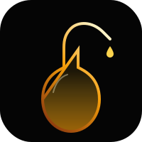

<p align="center">
  <a href="#"></a>
</p>

# Blending Room

*Blend AI-casked knowledge with human judgment.*

**[한국어](docs/README.ko.md)**

---

```
 Explore          Filter           Select           Edit
 ──────           ──────           ──────           ──────
 [ Graph ] ──→ [ Narrow ] ──→ [ Inspect ] ──→ [ Blend ]
```

Blending Room is a web dashboard for the **Distillery** knowledge graph. Like whisky blending, humans combine and refine the raw material — **knowledge nodes** and **relationships** — that AI has casked, using their own senses and judgment.

Browse the graph visually, filter by relationship type, inspect node details, and edit edges and content. Every human edit is recorded as `source: 'human'`.

---

## The Interface

### Graph Canvas

The main view renders the knowledge graph with **Cytoscape.js**. Nodes and edges are laid out using the cola force-directed algorithm.

| Interaction | Action |
|-------------|--------|
| **Click** | Open node/edge detail panel |
| **Double-click** | Expand subgraph around the node |
| **Right-click** | Context menu (add, edit, delete) |
| **Hover** | Highlight connected nodes |

### Edge Styles

| Relationship | Style |
|--------------|-------|
| `RELATED_TO` | Gray solid line |
| `SUPPORTS` | Green solid line |
| `CONFLICTS_WITH` | Red dashed line |
| `source: human` | Thicker stroke |

### Side Panel

Filter by relationship type or source, view node/edge details, and edit content — all without leaving the graph view.

---

## Tech Stack

```
Frontend   Svelte 5 (runes) · SvelteKit · TypeScript
Graph      Cytoscape.js · cytoscape-cola
Styling    Tailwind CSS 4 · DaisyUI 5
Backend    Elysia server (separate project, proxied via Vite)
Runtime    Bun
```

---

## Getting Started

### Prerequisites

- [Bun](https://bun.sh) (or Node.js)
- Distillery Elysia backend server running

### Install

```bash
bun install

cp .env.sample .env
# Edit .env and set VITE_API_URL (default: http://localhost:3000)
```

### Develop

```bash
bun run dev
```

### Build

```bash
bun run build
bun run preview
```

### Type Check

```bash
bun run check
```

---

## API Endpoints

| Action | Method | Endpoint |
|--------|--------|----------|
| Fetch graph | `GET` | `/graph` |
| Node detail | `GET` | `/graph/node/:id` |
| Expand subgraph | `GET` | `/graph/node/:id/expand` |
| Update node | `PUT` | `/graph/node/:id` |
| Create edge | `POST` | `/graph/edge` |
| Update edge | `PUT` | `/graph/edge` |
| Delete edge | `DELETE` | `/graph/edge` |
| Keyword search | `GET` | `/search/keyword?q=...` |

---

## Project Structure

```
src/
├── routes/             # SvelteKit pages
├── lib/
│   ├── components/     # Svelte components (GraphCanvas, SidePanel, TopBar, ...)
│   ├── graph/          # Cytoscape config, styles, events, context menu
│   ├── stores/         # Svelte 5 runes stores (graph, ui, search, auth, toast)
│   ├── api/            # Fetch wrapper + endpoint modules (graph, node, edge, search)
│   ├── types/          # TypeScript type definitions
│   ├── mock/           # Mock data for development
│   └── utils/          # Utilities (edge-id, debounce)
```

---

<p align="center"><sub>pitch black, amber-lit.</sub></p>
